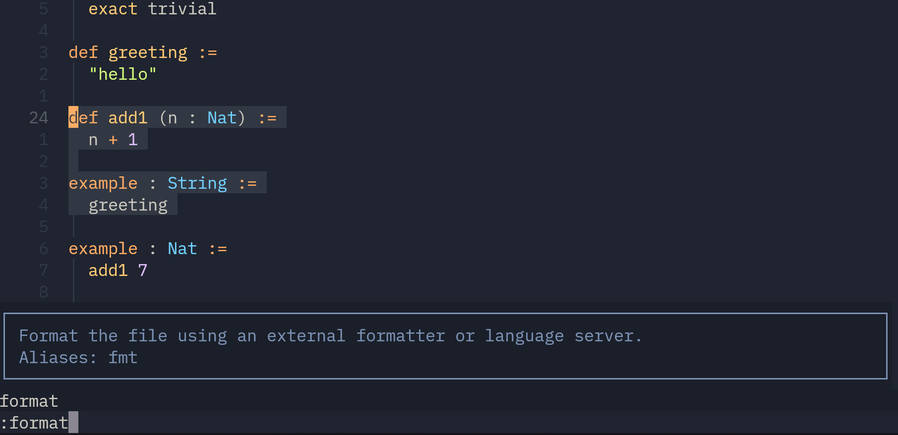
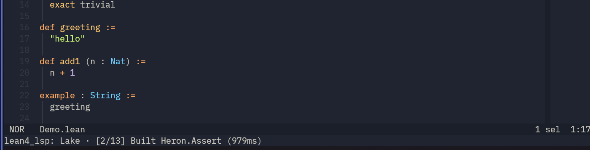
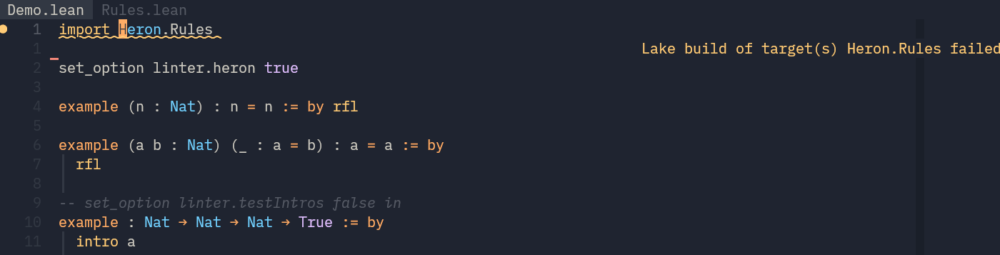
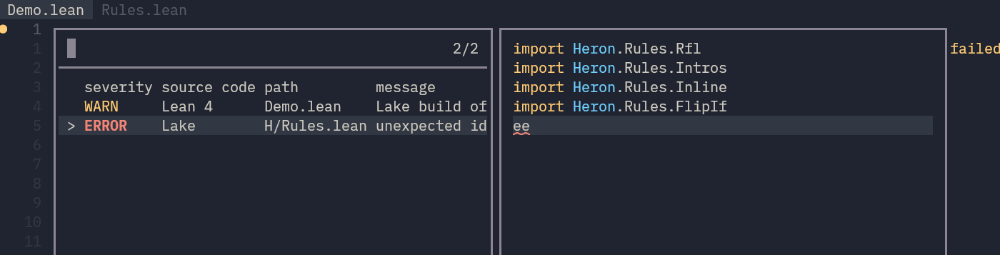
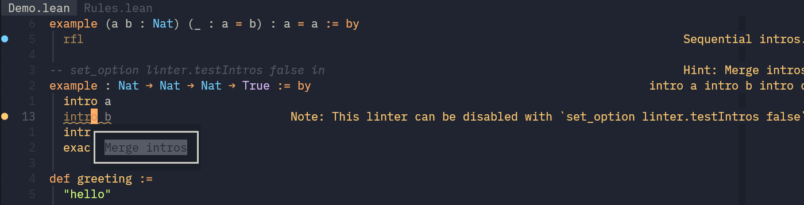
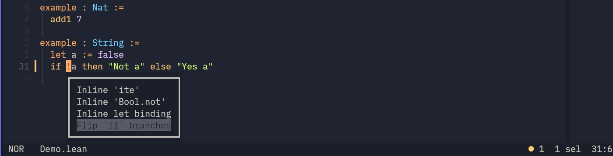
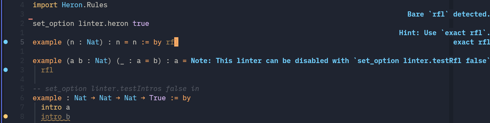
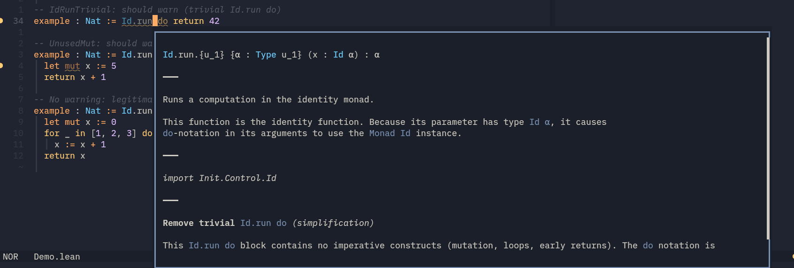
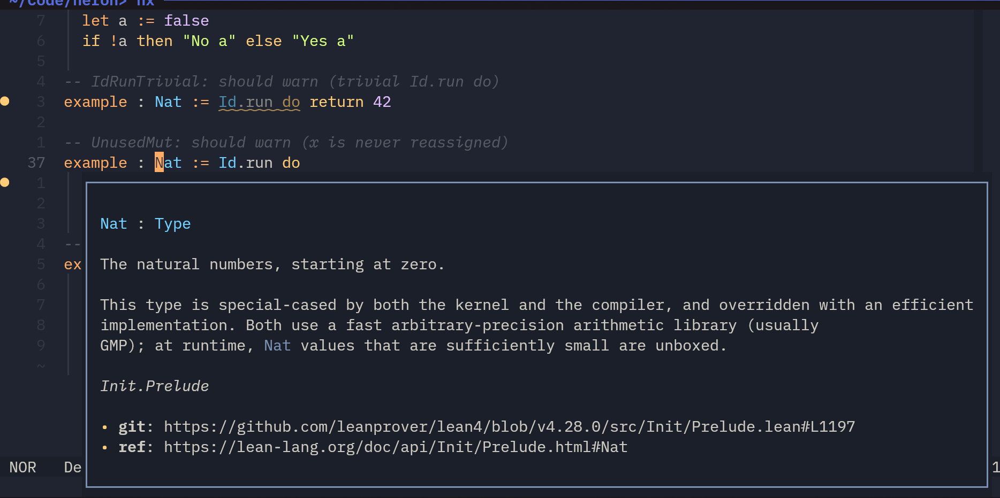

# Lean

Fork of the [official Lean repo](https://github.com/leanprover/lean4) focused on **making life easier for terminal-only Lean developers.**

_(For testing new features and up-streaming them later.)_

<!--toc:start-->

- [Lean](#lean)
  - [Additions and Fixes to Upstream](#additions-and-fixes-to-upstream)
    - [LSP Formatter](#lsp-formatter)
    - [CLI Formatter (WIP)](#cli-formatter-wip)
    - [LSP Setup Progress](#lsp-setup-progress)
    - [Compact `lake build` Output](#compact-lake-build-output)
    - [Workspace Diagnostics in Failed Targets](#workspace-diagnostics-in-failed-targets)
    - [User-Defined Code Actions](#user-defined-code-actions)
    - [Diagnostic Tags](#diagnostic-tags)
    - [Linter Severity Levels](#linter-severity-levels)
    - [Detailed Diagnostic Popups](#detailed-diagnostic-popups)
    - [LSP Initialization Options](#lsp-initialization-options)
    - [Links to Reference Manual](#links-to-reference-manual)
    - [`lake install` (WIP)](#lake-install-wip)
    - [Nix Build Improvements](#nix-build-improvements)
  - [Installation](#installation)
    - [Without Nix Flakes](#without-nix-flakes)
    - [With Nix Flakes (Recommended)](#with-nix-flakes-recommended)
  - [Development](#development)
    - [Structure](#structure)
    - [Development Shell](#development-shell)
    - [LSP for Lean Development](#lsp-for-lean-development)
    - [Disabling `elan`](#disabling-elan)
  - [Related](#related)

<!--toc:end-->

## Additions and Fixes to Upstream

### LSP Formatter

Integrated Lean formatter in the LSP server. Editors that support `textDocument/formatting` get formatting automatically.

You can also format selections using range formatting.



Only requires parsing, not elaboration.

### CLI Formatter (WIP)

You can also format files from the command line with the `format` subcommand:

```bash
lake format file.lean                     # format a file in place
lake fmt file.lean
```

Or use Lean binary itself (slightly faster)

```bash
lean --format file.lean                   # format directly via lean binary
lean --format-check file.lean             # check formatting via lean binary
```

### LSP Setup Progress

Real-time `$/progress` notifications during Lake dependency setup, replacing the old diagnostic-based approach.



### Compact `lake build` Output

When Lake build fails, it displays a structured summary with error count and the failed target names.



### Workspace Diagnostics in Failed Targets

Diagnostics from dependencies appear as cross-file entries in the workspace diagnostics picker, so you can jump directly to errors in other files. Stale cross-file diagnostics clear automatically when dependencies are fixed and the file worker restarts.



### User-Defined Code Actions

Linters can register code action providers to offer quick-fix suggestions in the editor. Supports eager actions (computed immediately) and lazy actions (resolved on click via `codeAction/resolve`).



Lazy code actions (refactors):



Upstream discarded `infoState` after linters ran, which meant info tree nodes pushed by external linters had no context, causing panics when the editor tried to resolve code actions. This fork wraps linter execution in `withInfoTreeContext` and preserves `infoState` through the `finally` block in `runLinters`, so code actions from external linters work correctly.

See [Heron](https://codeberg.org/wvhulle/heron) for real-world examples of custom diagnostics, code actions built on these changes.

### Diagnostic Tags

In upstream Lean, diagnostic tags (`unnecessary`, `deprecated`) are hardcoded, only the built-in `unusedVariables` linter can emit `unnecessary` and only the built-in `deprecated` linter can emit `deprecated`. External linters have no way to tag their own diagnostics.

This fork adds a `diagnosticTags` field directly on `BaseMessage` and extends `logAt`/`logLint` to accept tags:

```lean
-- Any linter can now emit diagnostic tags
logLint linter.myLinter stx m!"unused import" (diagnosticTags := #[.unnecessary])
logAt stx (.tagged ``myAttr m!"obsolete API") .warning (diagnosticTags := #[.deprecated])
```

### Linter Severity Levels

Create diagnostics with different levels. Notice how different levels generate different colors in the UI according to your editors color theme:



### Detailed Diagnostic Popups

Detailed explanations of diagnostics are shown below doc-comments and types. Diagnostic providers should pass extra metadata with every violation.



### LSP Initialization Options

Pass Lean options (the `-D` flags) through your editor's LSP config instead of CLI arguments.

Helix `languages.toml`:

```toml
[language-server.lean]
command = "lake"
args = ["serve"]

[language-server.lean.config]
options = { "pp.all" = false, "pp.unicode" = true }
```

### Links to Reference Manual

Hover popups with documentation include links to the source in GitHub and official Lean reference manual. You can also configure additional data resources using LSP config.



### `lake install` (WIP)

Install Lake executables globally to `~/.lake/bin/` (similar to `~/.cargo/bin` for Rust). Add `~/.lake/bin` to your `PATH` to use installed executables directly.

```bash
lake install                              # install all executable targets
lake install myexe                        # install a specific target
lake install --git <url>                  # install from a remote repo
```

### Nix Build Improvements

The `flake.nix` splits the build into cached `stage0` (C-only) and `stage1` (Lean) targets for [Nix](https://wiki.nixos.org/wiki/Flake) users, configures `ccache` in the dev shell, and provides a public shared Cachix cache for stage compilation artifacts.

## Installation

### Without Nix Flakes

You should be able to use the same process using CMake as recommended in upstream (unmodified) docs in [`doc`](./doc). The build with CMake itself was not modified.

### With Nix Flakes (Recommended)

Nix flakes are a way to install heterogeneous software reproducible and easily. Add this repo as a Nix flake input to any of your Flake-based Nix projects:

```nix
{
  inputs.lean4.url = "github:wvhulle/lean4";

  outputs = { nixpkgs, lean4, ... }:
    let
      pkgs = nixpkgs.legacyPackages.x86_64-linux;
      lean = lean4.packages.x86_64-linux;
    in {
      devShells.x86_64-linux.default = pkgs.mkShell {
        packages = [ lean.lean ];
      };
    };
}
```

The Nix flake outputs the same binaries as upstream, but just packages that in isolated Nix packages:

| Package | Description |
| ------------- | ---------------------------------------------- |
| `lean` | Lean compiler (alias for `stage1`) |
| `lake` | Lake build tool (same derivation, runs `lake`) |
| `leanc` | Lean C compiler wrapper |
| `leanchecker` | Lean proof checker |
| `leanmake` | Lean make tool |

Run the Lean binaries directly without installing them permanently:

- `nix run .#lean`
- `nix run .#lake`

The first time, you can choose between:

- Compiling from scratch: this might take very long as `stage0` needs to be built (+20 minutes). Builds are cached until you do a Nix garbage collection.
- Using the Cachix cache (recommended): downloads prebuilt artifacts

Less commonly used binaries are also included:

- `nix run .#leanc`
- `nix run .#leanchecker`
- `nix run .#leanmake`

## Development

### Structure

The Nix flake outputs are named after upstream conventions. Lean compilation is split into several stages. Each stage is mapped to a Nix build target that can be cached by Nix.

| Package | C (transpiled) | C++ (runtime) | Lean | Description |
| --------- | -------------- | ------------- | ---- | ------------------------------------ |
| `stage0` | yes | yes | no | Bootstrap compiler |
| `stage1` | no | yes | yes | Full toolchain, compiled by `stage0` |
| `stage2` | no | yes | yes | Verification rebuild by `stage1` |
| `default` | | | | Alias for `stage1` |

All tool packages (`lean`, `lake`, `leanc`, `leanchecker`, `leanmake`) are the same derivation with a different entry point. Building any one of them gives you the complete toolchain.

### Development Shell

`nix build` always builds from scratch in a sandbox. Use the Nix dev shell when working on the Lean codebase (and ignoring the part of `stage0`):

```bash
nix develop
```

This might take awhile, since Nix will build and cache `stage0`.

I recommend installing `direnv` and creating a `.envrc` file:

```bash
use flake
```

Configure CMake once. This sets up the build to use the cached `stage0` (skips ~20min bootstrap):

```bash
nix run .#configure
```

Build (and rebuild after editing `src/*`) with:

```bash
nix run .#buildCMake
```

Both commands work outside the dev shell — they carry their own dependencies via Nix.

### LSP for Lean Development

```bash
make -C build/release stage1
cd src && lake serve
```

### Disabling `elan`

You should disable Elan. The dev shell handles this automatically: it disables elan via `ELAN=""` and prepends `build/release/stage1/bin` to `PATH`.

Otherwise, you should register a local build as a custom toolchain:

```bash
elan toolchain link lean4-local ./build/release/stage1
```

This makes the locally-built stage1 available under the name `lean4-local`. You can then use it in any project by setting the `lean-toolchain` file:

```
lean4-local
```

Or override it for a single command:

```bash
elan run --install lean4-local lake build
```

To register the Nix-built stage1 instead of a `make` build:

```bash
elan toolchain link lean4-local "$(nix build .#stage1 --print-out-paths)"
```

## Related

This project primarily serves as an easy way for me to hack on the upstream Lean codebase while using Nix.

Try some of my other Lean projects:

- [Lean-TUI](https://codeberg.org/wvhulle/lean-tui): terminal-only info view for proof visualization
- [Heron](https://codeberg.org/wvhulle/heron): comprehensive linter and auto-fixer for Lean
